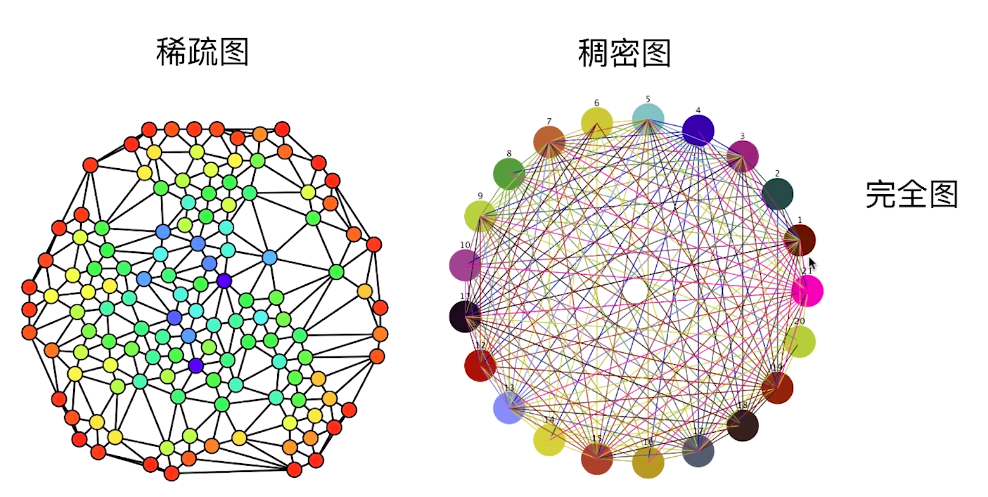
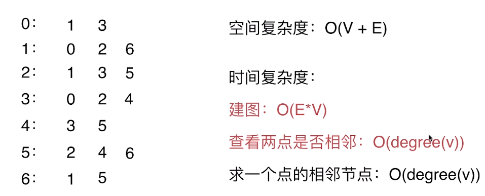
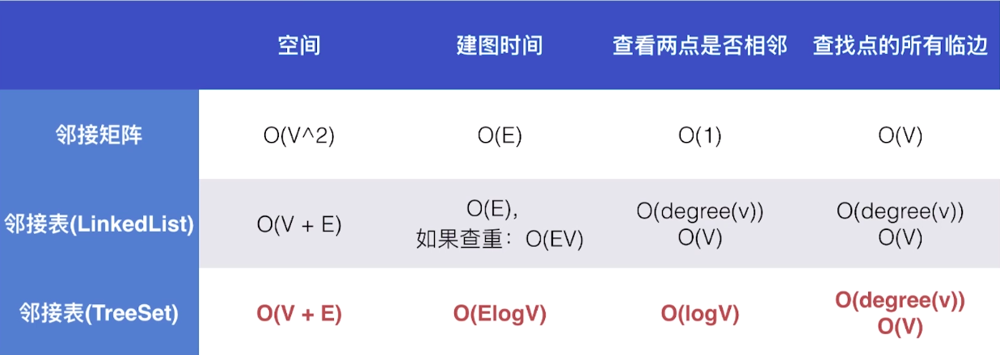
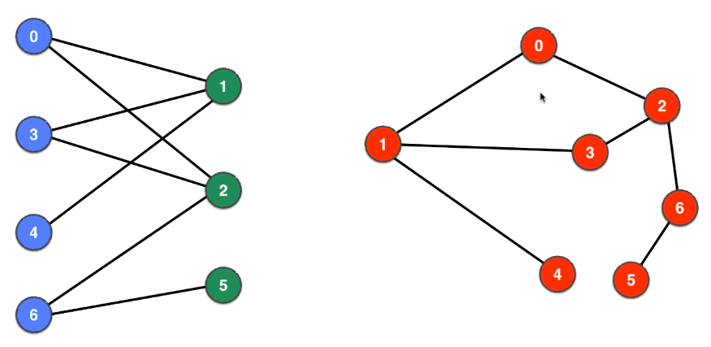

# 图论算法

## 图的表示
### 邻接矩阵
adj[i][j] = 1 表示顶点i和顶点j相邻
- 对于简单图：主对角线为0
- 对于无向图：矩阵关于主对角线对称
- 简单图：
	- 没有自环：加入的两个顶点一样
	- 没有平行边：添加的两个节点之间的边在邻接矩阵中已经存在（adj[i][j] == 1）
#### 邻接矩阵的复杂度分析与瓶颈


- 简单来说一张图中的度数远小于节点构成的完全图的度数，那么就是稀疏图


### 邻接表


#### 邻接表复杂度
- 空间复杂度：O(V + 2E) => O(V + E)
- 邻接表中在求一个点的邻接节点只与该点的邻接点有关，这比邻接矩阵快，不需要遍历剩余不邻接的节点 

解决方案
- 快速查重
- 快速查看两点是否相邻
	- 在查找的过程中链表的查询效率是线性的，所以可以不使用链表：
		- HashSet => O(1)
		- TreeSet => O(logV)
		
#### 邻接表的改进
- 改进contains方法(查重，处理平行边)，将链表O(V)级别的复杂度优化为HashSet的O(1)或者TreeSet的O(logV)级别
- 基于TreeSet的优点是：相对于HashSet，它避免了没有用到的哈希值而开辟的多余空间；并且输出的顺序为从小到大
    缺点是：时间复杂度稍微慢一点，但是是可以接受的

### 不同图的表示比较


## 图的深度遍历
- 与树不同的是，需要标记遍历过的节点
```
dfs(v){
    visited[v] = true
    //do something with v
    for(w <- adj(v)){
        if(!visited[w])
            dfs(v)
    }
}
```
- dfs的终止条件包含在for循环中
    - 如果节点v没有邻接节点就不进入for
    - 如果节点全都被访问过了就没有进入下一步dfs递归
    
- dfs的复杂度：O(V + E)

- 作用：
    - 查看图是否连通
    - 有几个连通分量
    - 求两点是否连通以及之间的路径
    - 检测图中是否有环
    - 二分图的检测
    - 寻找图中的桥与割点
    - 哈密尔顿路径
    - 有向图中：拓扑排序
   
### 联通分量
- 进行一次完整的dfs后，说明完成了一次联通分量的遍历，将联通分量cccount加一

### 单元路径问题
- 利用一个int类型的pre[]数组记录遍历的节点v的上一个节点
    
### 检测无向图中的环
- 节点v的相邻节点w被访问过后，检测该节点w不是w的上一个节点parent，就说明有环

### 二分图的检测
#### 条件
- 顶点V可以分成不相交的两部分
- 所有边的两个顶点隶属于不同的部分



#### 解决方式
通过DFS将顶点”染色”的方式分为两个部分
- 开一个int型color[]数组顶点的记录染色情况
- 检测如果访问过的邻接顶点w颜色与该顶点v的颜色相同，就说明这两边的顶点属于同意部分，不满足二分图
