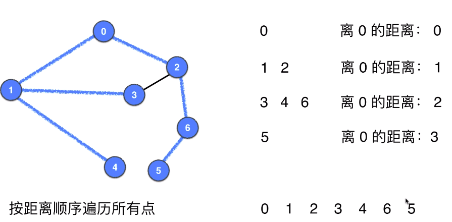

# 图的广度优先遍历

## 实现BFS 
- 与树的BFS**相同**的是都需要一个队列
- 与树的BFS**不同**的是图存在环的情况，因此需要检查节点是否已经遍历过
- 与dfs相同，需要一个visited[]记录节点是否入过队
- 在出队后，将其记录到遍历结果中

**复杂度与DFS中相同，都为：O(V + E)**

### 单源路径问题
- pre[]记录结点的前一个结点

## BFS的重要性质
- 使用BFS求单源路径时，得到的都是源点到目标顶点的**最短路径**（无权图中假设边权重相同都为1）

最短路径的原因：回顾树的广度优先遍历，发现其遍历顺序可以看作根据根节点的距离从近到远遍历的，那么对于图来说也是一样的。

## 无权图的最短路径
- 用dis[]记录每个节点到源结点的距离
- 每遍历到没有遍历过的结点就计算邻接顶点的距离，dis[adj] = dis[v] + 1

 