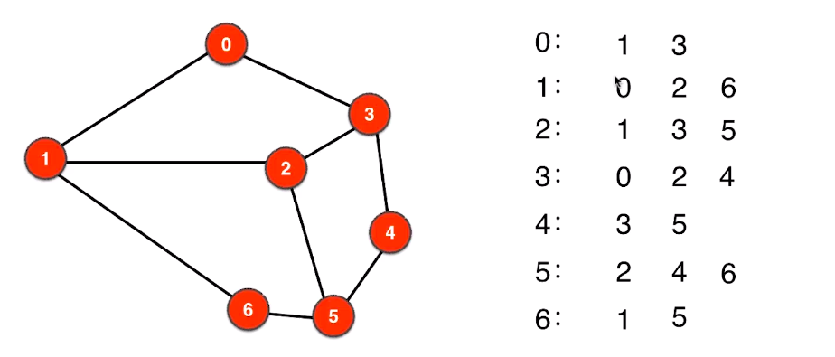

# 图论算法

## 图的表示
### 邻接矩阵
adj[i][j] = 1 表示顶点i和顶点j相邻
- 对于简单图：主对角线为0
- 对于无向图：矩阵关于主对角线对称
- 简单图：
	- 没有自环：加入的两个顶点一样
	- 没有平行边：添加的两个节点之间的边在邻接矩阵中已经存在（adj[i][j] == 1）
#### 邻接矩阵的复杂度分析与瓶颈

- 简单来说一张图中的度数远小于节点构成的完全图的度数，那么就是稀疏图

### 邻接表

#### 邻接表复杂度
- 空间复杂度：O(V + 2E) => O(V + E)
- 邻接表中在求一个点的邻接节点只与该点的邻接点有关，这比邻接矩阵快，不需要遍历剩余不邻接的节点 

解决方案
- 快速查重
- 快速查看两点是否相邻
	- 在查找的过程中链表的查询效率是线性的，所以可以不使用链表：
		- HashSet => O(1)
		- TreeSet => O(logV)
